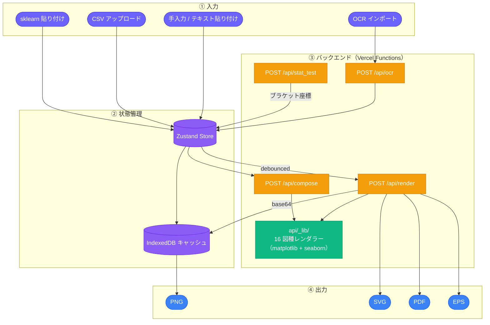
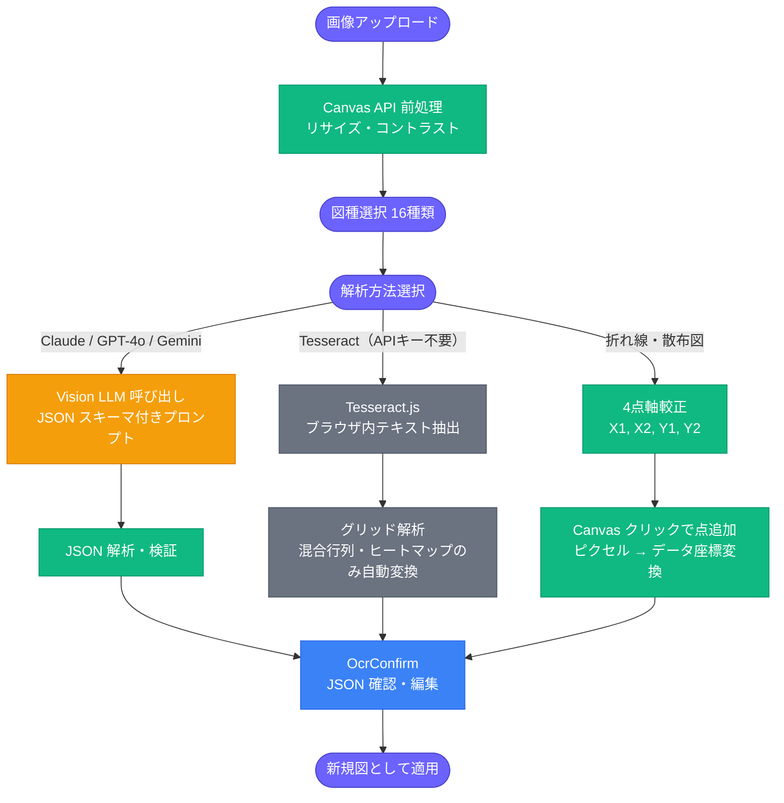
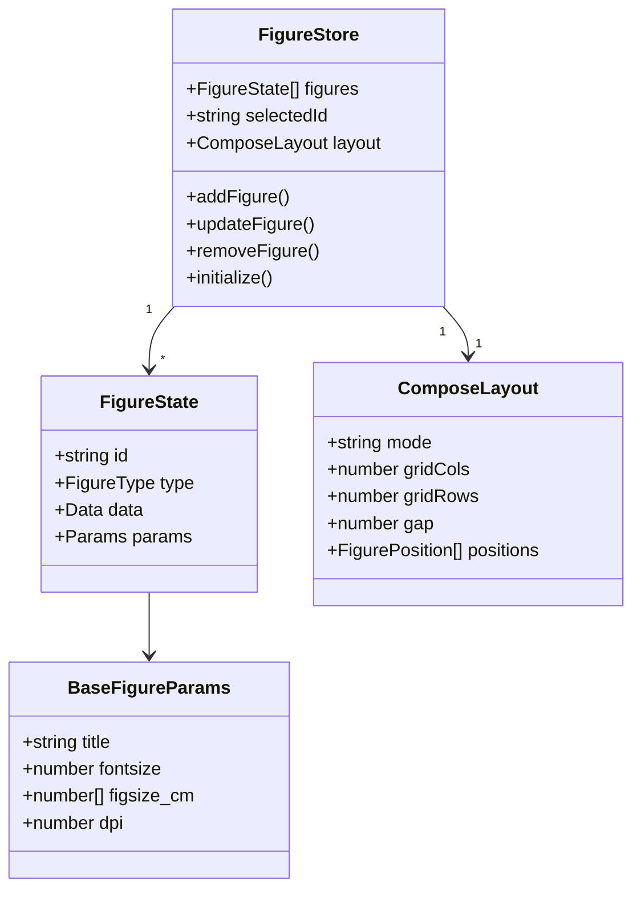

# Figure Modification

**研究・論文向けの図表をブラウザ上で編集・再生成・合成するツール**

[](https://react.dev)
[](https://www.typescriptlang.org)
[](https://vitejs.dev)
[](https://www.python.org)
[](LICENSE)

---

## 概要

機械学習・データ分析の研究で生成した図をブラウザ上でリアルタイム編集し、論文投稿品質の画像を出力する Web アプリケーション。

```
従来のワークフロー                    Figure Modification
━━━━━━━━━━━━━━━━━━━━━━━         ━━━━━━━━━━━━━━━━━━━━━━━━━━
Python スクリプトを実行
  ↓                                      データを入力 or CSV 読み込み
PNG を確認                 ──→                  ↓
  ↓                               パラメータをブラウザ UI で調整
コードを修正して再実行                  （色・ラベル・フォント・サイズ等）
  ↓                                           ↓
また PNG を確認                    PNG / SVG / PDF / EPS でダウンロード
```

matplotlib + seaborn による Python バックエンドが Vercel Functions 上で動作するため、出力は手元のスクリプトと完全に同じ描画エンジンで生成されます。

**公開 URL：** https://figure-modification.vercel.app/

---

## 課題背景

千葉工業大学 2026年前期「Web3・AI概論」の課題として作成しました。

**解決したかった問題：**
実験結果の図は分析コードとは別に「整形・調整」の作業が毎回発生する。ラベルの日本語化、論文の図サイズ（cm 指定）への変換、色の変更などのたびにスクリプトを修正・再実行するサイクルが非効率だった。

**対象ユーザー：**
LaTeX や Word で論文を書く学部生・大学院生・研究者。matplotlib で図を生成しているが、見た目の調整に時間を取られている人。

**一言紹介：**
matplotlib の図をブラウザ UI で編集・ダウンロードできる、研究者のための図表整形ツール。

---

## 対応図種（16種類）

| カテゴリ | 図種 | 主な用途 |
|--------|------|---------|
| 棒系 | 棒グラフ | カテゴリ別比較（グループ対応・閾値線・その他統合付き）|
| 棒系 | 積み上げ棒グラフ | 構成比の比較（100%積み上げ対応）|
| 棒系 | 棒+折れ線複合 | 棒グラフと折れ線の左右二軸重ね合わせ |
| 線/点/円系 | 折れ線グラフ | 時系列・連続値（複数系列・対数スケール対応）|
| 線/点/円系 | 散布図 | 2変数の分布（複数系列・透明度対応）|
| 線/点/円系 | 円グラフ | 構成比の可視化（ドーナツグラフ対応）|
| 分布系 | ヒストグラム | 値の分布 |
| 分布系 | 箱ひげ図 | グループ間分布比較（有意差ブラケット付き）|
| 分布系 | バイオリン図 | 分布の形状を含む比較（内部表示・エッジカラー対応）|
| 分布系 | エラーバー | 平均値と誤差の比較（有意差ブラケット付き）|
| 行列系 | ヒートマップ / 相関行列 | 特徴間相関・任意の2次元データ |
| 行列系 | 混合行列 | 分類モデルの性能評価 |
| ML 評価系 | ROC 曲線 | 分類器の閾値特性（AUC 表示・複数モデル対応）|
| ML 評価系 | PR 曲線 | 不均衡データの評価（AP 表示）|
| ML 評価系 | 学習曲線 | 訓練過程の可視化（左右二軸対応）|
| ML 評価系 | 特徴量重要度 | 変数の寄与度（Top-N フィルタリング）|

---

## 主な機能

### データ入力

- **手入力 / テキスト貼り付け**：各図種専用 UI から直接入力
- **sklearn 貼り付け**：`print(confusion_matrix(...))` 等の Python 出力をそのまま貼り付け
- **CSV アップロード**：全 16 図種に対応。ヒートマップは行・列ヘッダーを自動検出、学習曲線はヘッダー行を系列名として使用
- **OCR インポート**：図の画像をアップロードして Vision AI でデータを自動抽出（後述）

### 編集機能

- タイトル・軸ラベル・フォントサイズ・図サイズ（cm）・DPI
- カラーマップ・カラーパレット（デフォルト / 学術 / パステル / ビビッドの 4 プリセット）
- グリッド・凡例・軸範囲・目盛り間隔（全図種共通）
- 図種固有パラメータ（正規化・100%積み上げ・ドーナツ穴・括弧表示・inner 表示等）
- **統計有意差ブラケット**：Welch's t 検定・Mann-Whitney U 検定等で p 値を自動計算し、図上に直接描画

### 出力形式

- **PNG / SVG / PDF / EPS** の 4 形式に対応
- PNG はプレビューキャッシュから即座ダウンロード、SVG / PDF / EPS は専用レンダーパスで生成

### 複数図合成（Compose モード）

- グリッド配置・自由配置モードの切り替え
- 複数の図を 1 枚の画像として出力（論文のマルチパネル図向け）
- IndexedDB でセッション間も自動保存、並び替え・削除対応

### OCR インポート（図 → データ抽出）

図の画像を読み込み、データを自動抽出して新規図として追加する機能。

**解析方法は4種類：**

| 解析方法 | 特徴 | APIキー |
|--------|------|--------|
| **Claude** (claude-opus-4-5) | 高精度・グラフ構造の理解が得意 | Anthropic API キー要 |
| **GPT-4o** | 高精度 | OpenAI API キー要 |
| **Gemini 3.1 Flash Lite** | 高レートリミット・低コスト | Google AI API キー要 |
| **Tesseract.js** | ブラウザ内実行・APIキー不要 | 不要（混合行列・ヒートマップ以外は手動修正推奨）|

- API キーはブラウザの localStorage にのみ保存（サーバーには送信しない）
- 抽出 JSON をテキストエリアで確認・編集してから適用
- 折れ線・散布図は Canvas の **手動点取り**（4 点軸較正、WebPlotDigitizer 方式）も選択可能

---

## Screenshot

> **Add screenshot here.**
> `docs/screenshot.png` を配置後、以下のコメントアウトを解除してください。

<!--  -->

---

## アーキテクチャ

### システム全体



### OCR パイプライン



### データモデル



---

## 技術スタック

| カテゴリ | 採用技術 |
|---------|---------|
| フレームワーク | React 18 + TypeScript 5 |
| ビルド | Vite 6 |
| スタイリング | Tailwind CSS 4 |
| 状態管理 | Zustand 5 |
| 永続化 | IndexedDB（idb） |
| バックエンド | Vercel Functions（Python 3.12） |
| 図表描画 | matplotlib 3.8 + seaborn 0.13 + numpy 1.26 |
| Vision AI | Claude Vision / GPT-4o / Gemini 3.1 Flash Lite |
| OCR フォールバック | Tesseract.js（ブラウザ内 WASM 実行）|
| エラー監視 | Sentry（React + Python） |
| AI アシスタント | Claude Code（Anthropic） |
| デプロイ | Vercel |

---

## セットアップ

```bash
# リポジトリをクローン
git clone https://github.com/Axe0320/figure-modification.git
cd figure-modification

# 依存パッケージをインストール
npm install

# 開発サーバーを起動
npm run dev        # → http://localhost:5173
                   # Python API は別途: vercel dev

# ビルド
npm run build
```

---

## ディレクトリ構成

```
src/
├── components/
│   ├── input/          # 図種別データ入力 UI（16 種）
│   ├── editor/         # パラメータ編集パネル（16 種）
│   │   └── colorPalettes.tsx    # 4 プリセット共有コンポーネント
│   ├── compose/        # 複数図合成 UI
│   ├── import/         # OCR インポート
│   │   ├── ImportModal.tsx      # メインモーダル（ドロップゾーン・図種選択）
│   │   ├── OcrSettings.tsx      # API キー管理（localStorage）
│   │   ├── OcrConfirm.tsx       # 抽出 JSON 確認・編集
│   │   └── PointDigitizer.tsx   # Canvas 手動点取り
│   ├── preview/        # 図プレビュー・ダウンロード
│   └── common/         # 共通コンポーネント（CSV ボタン・FigureList 等）
├── api/
│   ├── figureApi.ts    # /api/render クライアント
│   └── ocrApi.ts       # /api/ocr クライアント
├── hooks/
│   └── useOcr.ts       # OCR 状態管理フック（Vision API + Tesseract.js）
├── ocr/
│   ├── imagePreprocess.ts  # Canvas ベース前処理（リサイズ・コントラスト）
│   └── tesseractWorker.ts  # Tesseract.js lazy-load ラッパー
├── store/
│   └── figureStore.ts  # Zustand（図データ + レイアウト）
└── types/
    └── figures.ts      # TypeScript 型定義（16 図種全て）

api/
├── render.py           # POST /api/render（単一図生成・図種名で動的 import）
├── compose.py          # POST /api/compose（複数図合成）
├── ocr.py              # POST /api/ocr（Vision AI 連携）
├── stat_test.py        # POST /api/stat_test（統計検定）
└── _lib/               # 図種別レンダラー（16 モジュール + common.py + vision.py）
```

---

## 制限事項

- **OCR インポート**：Tesseract.js は混合行列・ヒートマップ（数値格子）以外はグラフ構造の自動変換ができないため、手動修正が必要。Vision AI（Claude / GPT-4o / Gemini）は全16種に対応
- **コールドスタート**：Vercel Functions の初回リクエストは最大 3 秒程度かかる場合がある
- **統計ブラケット**：Bonferroni / Holm 補正対応。2群比較のみの場合は補正不要

---

## Version History

| Version | Focus | 主な追加機能 |
|---------|-------|------------|
| v1 | 混合行列 MVP | Vercel デプロイ検証 / 混合行列の Create + 編集 UI + PNG 出力 / Sentry 導入 |
| v2 | ヒートマップ | ヒートマップ（相関行列含む）/ セル値表示・カラーマップ・mask_upper |
| v3 | Compose | グリッド配置・自由配置 / IndexedDB 移行 / 複数図の合成 PNG エクスポート |
| v4 | 基本グラフ | 棒グラフ・折れ線・散布図（複数系列）・ヒストグラム / sklearn 貼り付け |
| v5 | ML 評価系 | ROC 曲線・PR 曲線・学習曲線（双軸）・特徴量重要度（Top-N フィルタリング）|
| v6 | 出力拡張 + CSV | PNG / SVG / PDF / EPS 出力 / 全図種への CSV インポート / カラーパレット 4 プリセット |
| v7 | OCR パイプライン | 画像 → Vision AI → FigureState 変換 / Canvas 手動点取り（折れ線・散布図）/ API キー設定 UI |
| v8 | 統計系 | 箱ひげ図・バイオリン図・エラーバー / 統計有意差ブラケット（t 検定・Mann-Whitney）|
| v9 | OCR 強化 + Compose 拡張 | Tesseract.js フォールバック / ブラウザ側 Canvas 前処理 / Compose SVG・PDF エクスポート / 多重比較補正（Bonferroni・Holm）|
| v10 | 新図種 + タブ整理 | 積み上げ棒グラフ・棒+折れ線複合・円グラフ（ドーナツ対応）追加 / 図種タブをカテゴリ別に並び替え |

---

## Roadmap

### Should

- [x] 出力形式選択（PNG / SVG / PDF / EPS）
- [x] 全図種への CSV インポート
- [x] カラーパレットプリセット（デフォルト / 学術 / パステル / ビビッド）
- [x] OCR インポート（Vision AI + Canvas 手動点取り）
- [x] 複数図合成（グリッド / 自由配置）
- [x] 統計有意差ブラケット
- [x] Compose の SVG / PDF エクスポート
- [x] Tesseract.js フォールバック（APIキーなしで OCR）
- [x] 統計検定の多重比較補正（Bonferroni・Holm）
- [x] 積み上げ棒グラフ・棒+折れ線複合・円グラフ
- [ ] プリセット保存・共有リンク（Supabase 連携）

### Could

- [ ] 既存 3 ツールとの統合（pnpm workspace）
- [ ] ダークモード
- [ ] Plotly 等インタラクティブ図出力

---

## 関連プロジェクト

本プロジェクトは以下のツール群と統合予定の研究ツールチェーンの一部として設計されています。

| ツール | 概要 |
|--------|------|
| [LaTeX Table Composer](https://github.com/Axe0320/latex-table-composer) | 表データを LaTeX に変換・整形 |
| [LaTeX Figure Composer](https://github.com/Axe0320/latex-figure-composer) | LaTeX の figure 環境を GUI で構成 |
| [Citation ⇄ BibTeX Converter](https://github.com/Axe0320/citation-bibtex-converter) | 引用形式と BibTeX の相互変換 |

---

## 備考

本リポジトリは、千葉工業大学「Web3・AI概論」課題の要件である以下を満たすよう作成しています。

1. AI 支援（Claude Code）を活用したプロトタイプ開発
2. 研究・学習上の実課題を解決するプロダクトの試作
3. GitHub へのソースコード公開
4. Vercel へのデプロイ

---

## License

[MIT License](LICENSE)
